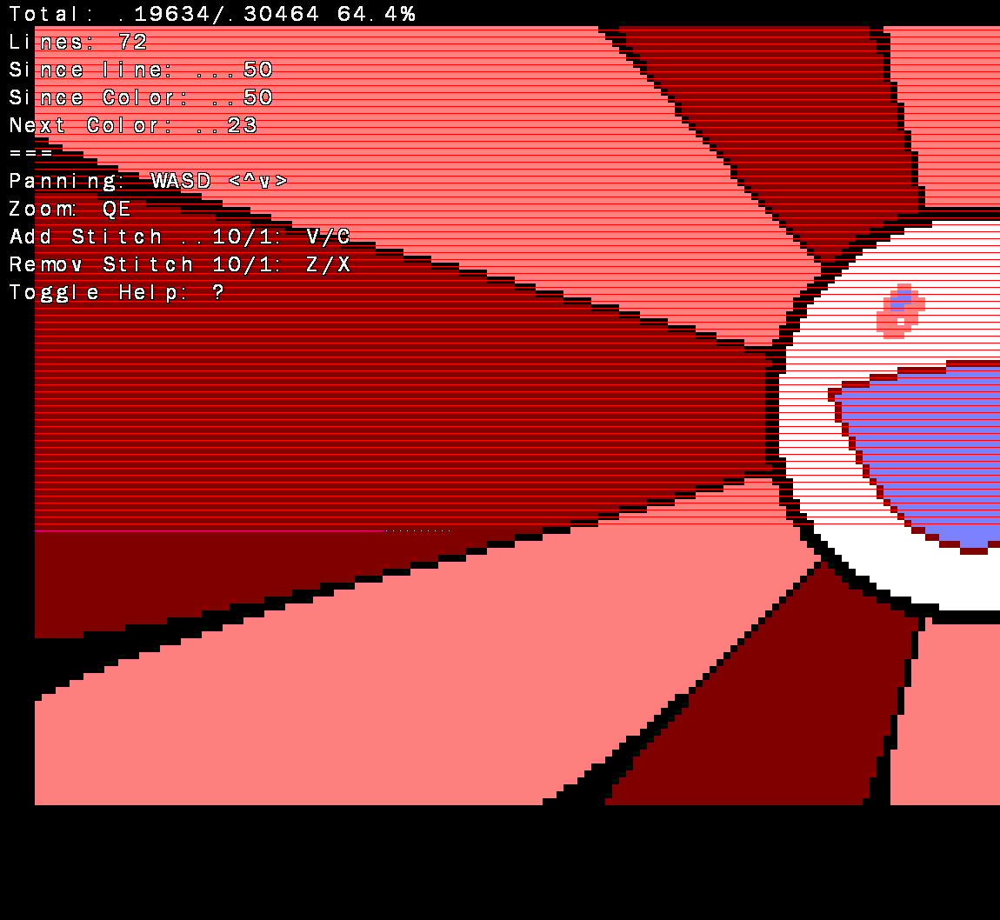

# Crochet Helper

A SDL2 based application to help me crochet an image pixel by pixel. Can drop
image files into the main window or open by command line. Supports RGB png modes
as well as indexed colors.

You can mark stitches complete by 1 with C and by 10 with V. Other controls are
shown in the expanded help text, toggled by ?

## Making images

If you know the size of your stitches gimp will help you set pixels per inch,
normally I crochet with quarter inch square stitches so I set 4 pixels per inch.
Gimp also helps with reducing colors by setting an automatically deduced
indexed color palette in Image > Mode > Indexed.

## Files Created

Information is saved per-image locally at `.YOURIMAGENAME.png.save` this is a
very small file containing one number written in little endian binary.

A `crochet_stats.csv` file is also created and appended locally containing the
date the application was start, for how long, and how many stitches were made.
It sounded fun to track my progress over time and import this data into
spreadsheets.

## Building

Requires [zig v0.9.1](https://ziglang.org) and
[SDL2](https://www.libsdl.org/download-2.0.php).

Building on Windows is a busted hard coded path in `build.zig`. I plan to
convert this project to use lovely Zig SDL2 bindings from [this
repo](https://github.com/MasterQ32/SDL.zig).

Linux builds fine if sdl2 is installed through package managers.
